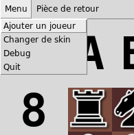

# ♟️ Chess Project ♟️

Chess software & artificial intelligence

## Getting Started

These instructions will get you a copy of the project up and running on your local machine for development and testing purposes. See deployment for notes on how to deploy the project on a live system.

### Requirements

* Python 3.7+
* Tkinter for Python 3+

```bash
sudo apt-get install python3-tk

or

sudo dnf install python3-tkinter
```

### Directory layout

    .
    ├── ia                   # Put all the A.I's here
    ├── sprites              # Sprites needed by the graphical part
    ├── src                  # Source files (of the graphical and playing part)
    ├── images               # Images for the readme
    ├ play.txt               # File created every time you play (history of moves)
    └ README.md

> Use short lowercase names at least for the top-level files and folders (except
> `README.md`)

## Software

### Start the project

Start the project : The only thing you have to do is to run the main file (and your A.I if needed)

```bash
cd src/
./main.py
```

If you want to start an A.I just run it from an other terminal while ./main.py is running (run twice if you want to do A.I vs A.I)

```bash
cd ia/
./very-hard-ai.py
```


### Graphical part

##### Main page

The software looks like this (French version) :


1) Menu bar 
2) White player status
3) Black player status
4) Board
5) Piece back for the white player for a promotion
6) Piece back for the black player for a promotion


##### Menubar



1) Add a human player
2) Change skin
3) Debug (print moves and board in game)
4) Quit


1) Change back up piece for the promotion (White player)
2) Change back up piece for the promotion (Black player)

#### Status

Squares are here to indicate the status of each player

 Waiting for a player (A.I or human)

 Not your turn (Just wait)

 Your turn (It's your time to play !)

 Be carefull ! (The opponent check you)


### Code part

#### How it works

This software comunicates with the A.I by txt file.

Every game it will create a plays.txt file.
This file will have all the moves of the game.
So if you want to "connect" your A.I with the software you will have to play your moves in this file.

Exemple of the content :

```
START
[NEW] WHITE
START
[NEW] BLACK
[TURN] WHITE
[PLAY] WHITE C2C3
[TURN] BLACK C2C3
[PLAY] BLACK D7D5
[TURN] WHITE D7D5
[PLAY] WHITE D2D4
[TURN] BLACK D2D4

[END] BLACK
```

Every line is explained by a keyword :

* START -> Printed by the A.I to say that it's connected
* [NEW] PLAYER -> Response by the software after "START"
    * PLAYER = Witch side you are
* [TURN] PLAYER MOVE -> Sofware saying that's the turn of someone
    * PLAYER = player to play (== "WHITE" or "BLACK")
    * MOVE = last move played by opponent (== "B4B2")
* [PLAY] PLAYER MOVE -> A.I response after a "[TURN]" to indicated the moves that he choose
    * PLAYER = player witch as play (== "WHITE" or "BLACK")
    * MOVE = move that you want to do (== "B4B2")
* [END] PLAYER -> end of the game
    * PLAYER = player who wins (or message if null)


#### Template

If you want to code your ia and integrated it to my program, you can find a template in the "ia" folder.
Or code your own starting with an empty file !

If you want to use the template :

1) The function "yourTurn()" is called when you have to play
2) You will just need to call "writeFile()" function with the move that you want to do.

```
def yourTurn(player, read):
    #print(read)
    writeFile("[PLAY] " + player + " B1C3")
```

The move to print should be like this : [PLAY] + player + move

1) [PLAY] == "[PLAY]"
2) player == "WHITE" or "BLACK" (your side)
3) move = "B1C3" (If you do a promotion add the letter of the piece that you want to back up (the letter should be the french letter))

Exemple : "[PLAY] BLACK B1C3" or  "[PLAY] WHITE C2C1d"

(to know each letter meaning check letters part)

#### Board information

If you need information of the board you have 3 methods

1) The "read" parameter of "yourTurn()" function contains the last move

2) You read the boardInformation.txt file that will have the board printed as an array (or call the function getBoardInformation() from the template)

3) You read the totalMovesInformation file that will have the total moves played printed as an array (or call the function getTotalMovesInformation() from the template)


```
boardInformation.txt

>> [['T', '.', 'F', 'D', '.', 'T', 'R', '.'], ['P', 'P', '.', '.', 'F', '.', 'P', 'P'], ['.', '.', 'C', '.', 'P', 'P', '.', '.'], ['.', '.', '.', 'P', 'p', '.', '.', '.'], ['.', '.', '.', '.', '.', '.', 'C', '.'], ['.', 'c', 'p', 'f', '.', 'c', '.', '.'], ['p', 'p', '.', '.', 'd', 'p', 'p', 'p'], ['t', '.', 'f', '.', '.', 't', 'r', '.']]


totalMovesInformation.txt

>> ['C2C3', 'D7D5', 'D2D4', 'C7C6', 'G1F3', 'E7E6', 'B1D2', 'G8F6', 'E2E3', 'F8D6', 'F1D3', 'E8G8', 'E1G1', 'C6C5', 'D4C5', 'D6C5', 'E3E4', 'B8C6', 'D1E2', 'C5E7', 'E4E5', 'F6G4', 'D2B3', 'F7F6']

```


#### Letters

Letters used in the txt file and getBoardInformation() function :

French Name | French letter | English Name| English letter | Figurine
------------ | ------------- | ------------- | ------------- | -------------
Roi | R | King | K | ♔ ♚
Dame | D | Queen | Q | ♕ ♛
Tour | T | Rook | R | ♖ ♜
Fou | F | Bishop | B | ♗ ♝
Cavalier | C | Knight | N | ♘ ♞
Pion | P | Pawn | P |♙ ♟


## Authors

* **Luis Rosario** - *Member 1* - [Luisrosario](https://github.com/Luisrosario2604)

